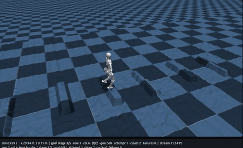

# N2 人形机器人多地形强化学习与 Sim2Sim

**Isaac Gym · PPO · 时序高程感知 · PyTorch/TorchScript · MuJoCo**

为 N2 人形机器人双腿 10 自由度学习统一运动策略，串联上楼、下楼、跨栏、平地路点和踏石五类地形，并将策略从 Isaac Gym 导出到 MuJoCo 验证。

这是吴淑林的实习项目作品集。本人负责 **总体技术路线、任务与方法设计、模块协调及材料整合**；训练、检查点筛选与部署评测由团队按报告分工完成。本仓库保留 Noetix 上游与团队代码历史。

## 演示视频

- **[Isaac Gym 多地形完整演示（约 2 分 43 秒）](media/isaac-gym-multiterrain.mp4)** · [直接下载](https://raw.githubusercontent.com/lnwuuwu/noetix_n2_gym/main/media/isaac-gym-multiterrain.mp4)
- **[MuJoCo 跨引擎完整演示（约 2 分 13 秒）](media/mujoco-sim2sim.mp4)** · [直接下载](https://raw.githubusercontent.com/lnwuuwu/noetix_n2_gym/main/media/mujoco-sim2sim.mp4)

MP4 是报告材料中的原始录屏，仅重命名；[校验信息](media/manifest.json)可核对。GIF 为 MuJoCo 视频片段预览。归档演示与最终部署版本的量化回放分别列示，不凭录屏推导统计成功率。

## 我的工作与团队分工

| 人员 | 报告记载职责 |
|---|---|
| **吴淑林** | 总体技术路线、任务与方法设计、各模块协调、答辩材料整合 |
| 杜军 | 强化学习训练、参数调整、日志分析、候选 checkpoint 量化筛选 |
| 赵汝坤 | 模型回放评测、实验数据整理、训练结果分析 |
| 武天豪 | MuJoCo Sim2Sim 验证、演示检查、部署文件整理 |

我重点展示的技术工作是：比较盲走、感知运动与 Parkour 路线；围绕观测、任务目标、失败模式和跨引擎接口组织方案设计与实现协作。代码文件是团队方案的对应实现，不等同于本人独立编写所有算法。见 [贡献与材料依据](docs/CONTRIBUTIONS.md)。

## 方法与实现

~~~mermaid
flowchart LR
    A[10 帧本体 / 任务历史] --> C[Actor: 输出双腿 10 维动作]
    B[10 × 96 点局部高程] --> D[扫描编码器: 960 → 32]
    D --> C
    C --> E[PD 跟踪 / Isaac Gym 并行环境]
    E --> F[PPO / 地形课程 / checkpoint 筛选]
    F --> G[TorchScript / JIT 导出]
    G --> H[MuJoCo: 重建观测 / 关节映射 / 控制契约]
    H --> I[五类地形串联评测]
~~~

| 设计 | 实现 / 参数 |
|---|---|
| 动作空间 | 双腿 10 维关节位置目标 |
| Actor 观测 | 单帧 137 维，10 帧历史，共 1370 维 |
| 高程编码 | 960 → 128 → 64 → 32，与 410 维本体历史拼接 |
| Actor 主干 | 442 → 512 → 256 → 128 → 10 |
| 并行训练 | 2048 环境，24 步 rollout，49,152 样本 / 更新 |
| 控制周期 | 物理 / PD 500 Hz，策略 50 Hz |
| 部署 | TorchScript/JIT，统一观测顺序、历史、关节映射、动作尺度和碰撞语义 |

源码入口：[任务环境](humanoid/envs/n2/n2_parkour_env.py)、[配置](humanoid/envs/n2/n2_parkour_config.py)、[扫描编码器 / Actor](humanoid/algo/ppo/actor_critic.py)、[MuJoCo 控制](sim2sim/sim2sim_parkour.py)。

## 最终模型与已有结果

发布包含：

- [policy_best_stable.pt](sim2sim/policy/policy_best_stable.pt)：报告归档 checkpoint 3800 的 JIT 部署策略。
- [部署配置](sim2sim/configs/n2_parkour_slow_stable.yaml)与[归档训练配置](sim2sim/configs/train_cfg_checkpoint_3800.json)。
- [最终回放的机器可读记录](docs/results/mujoco_final_replay.json)。

历史固定跑道的一次确定性回放：

| 指标 | 结果 |
|---|---:|
| 地形类别 | 5/5 |
| 路点 | 45/45 |
| 重置 / 失败 | 0 / 0 |
| 跑道长度 | 约 58.3 m |
| 仿真时间 | 119.902 s |

此结果证明该配置下训练、导出与跨引擎闭环可运行，不是多随机种子统计成功率，也不是实机测试结果。路点 / 高程当前来自仿真环境；机载深度感知和教师—学生蒸馏尚未完成。

## 快速运行

~~~bash
git clone https://github.com/lnwuuwu/noetix_n2_gym.git
cd noetix_n2_gym
~~~

在已准备 PyTorch、MuJoCo、NumPy 和 PyYAML 的环境中，只复核归档策略可采用：

~~~bash
python -m pip install -e . --no-deps
python sim2sim/sim2sim_parkour.py \
  --config_file=n2_parkour_slow_stable.yaml \
  --campaign_mode --check_only
~~~

可视化回放：

~~~bash
python sim2sim/sim2sim_parkour.py \
  --config_file=n2_parkour_slow_stable.yaml \
  --campaign_mode --render_fps=30 --no_debug_viz
~~~

训练还需 NVIDIA Isaac Gym Preview 4 与兼容 GPU 环境：

~~~bash
python humanoid/scripts/train.py \
  --task=n2_parkour_slow_stable --headless --num_envs=2048 \
  --sim_device=cuda:0 --rl_device=cuda:0
~~~

详细环境、批量评测与测试命令见 [运行说明](docs/RUNNING.md)。

## 发布检查与文档

- [贡献说明](docs/CONTRIBUTIONS.md)：本人工作、团队分工与材料来源。
- [结果说明](docs/RESULTS.md)：配置、历史回放与适用范围。
- [发布检查](docs/PUBLICATION_CHECKS.md)：72 项测试通过、2 项可选依赖测试跳过，JIT 输入输出检查通过。
- [原团队 / 上游 README](docs/reference/UPSTREAM_README.md)：其他基线任务的安装与用法。
- [原归档运行说明](项目运行说明.md)。

## 来源与许可

基于 [Noetix Robotics](https://github.com/Noetix-Robotics) 的机器人框架及 [JunDu-cyber/noetix_n2_gym](https://github.com/JunDu-cyber/noetix_n2_gym) 团队仓库进行项目适配。保留 [BSD 3-Clause LICENSE](LICENSE)、原作者信息和历史提交。NVIDIA Isaac Gym 为外部依赖，未随仓库重新分发。
